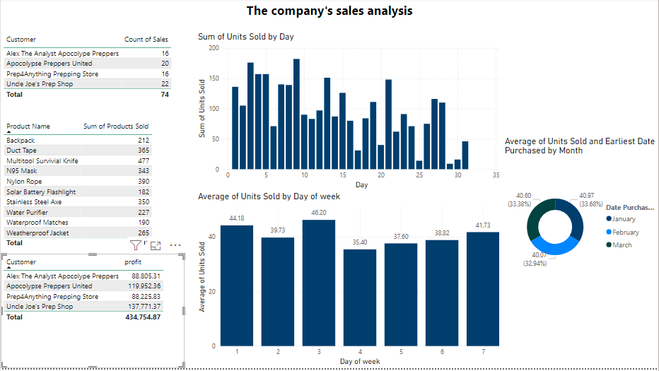
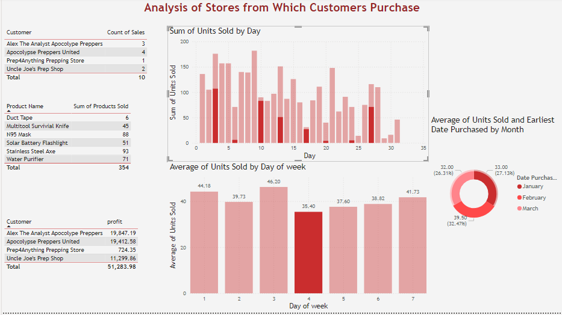

# Sales Analysis Dashboard

## Overview
Interactive Power BI dashboard built using DAX, Excel, and advanced data modeling techniques. The dashboard provides insights into sales performance, customer profitability, product demand, and purchasing trends to support data-driven business decisions.

## Key Features
Sales performance analysis
Customer profitability insights
Product demand tracking
Trend analysis and business reporting
Interactive visualizations and KPIs

## Tools Used
- Power BI
- DAX
- Excel
- Data Modeling

## Dashboard Preview

### Sales Analysis

### Customer Profit Analysis

## Files
- DAX.pbix
- Apocalypse Food Prep - DAX Tutorial.xlsx
- Average of Units Sold by Day of week.csv
